# 🧪 Azure Active Directory Lab (Windows Server + GPO)

Projeto prático de implementação de ambiente corporativo utilizando Windows Server com Active Directory em ambiente cloud.

## 📌 Objetivo
Simular um ambiente empresarial com controle de usuários, permissões e políticas de segurança.

## ☁️ Infraestrutura
* 1 VM Windows Server (Domain Controller)
* 1 VM Windows 10 (cliente)
* Rede virtual configurada (VNet e Subnet)
* Comunicação interna entre máquinas

---

## ⚙️ Tecnologias utilizadas

* Microsoft Azure
* Windows Server
* Active Directory
* Group Policy (GPO)
* DNS
* RDP

---

## 🚀 Etapas do projeto

### 1. Criação do Resource Group
Criação de Resource Group para provisionar toda infraestrutura

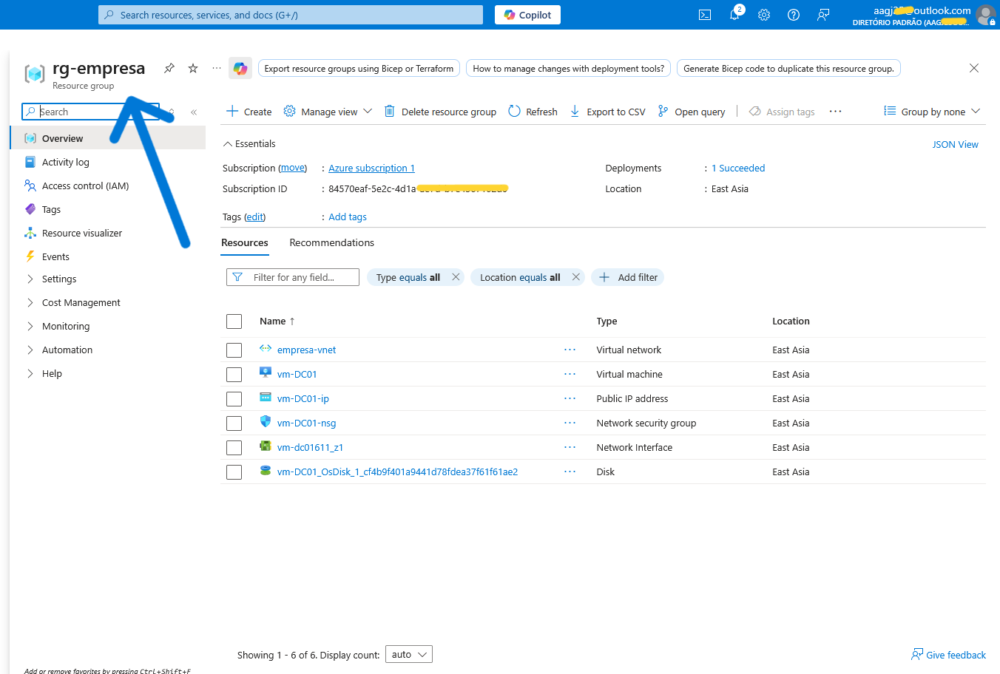

### 2. Deploy da VM (Domain Controller)
Após configuração da infraestrutura a ser utilizada, aguardamos pelo deploy da Virtual Machine

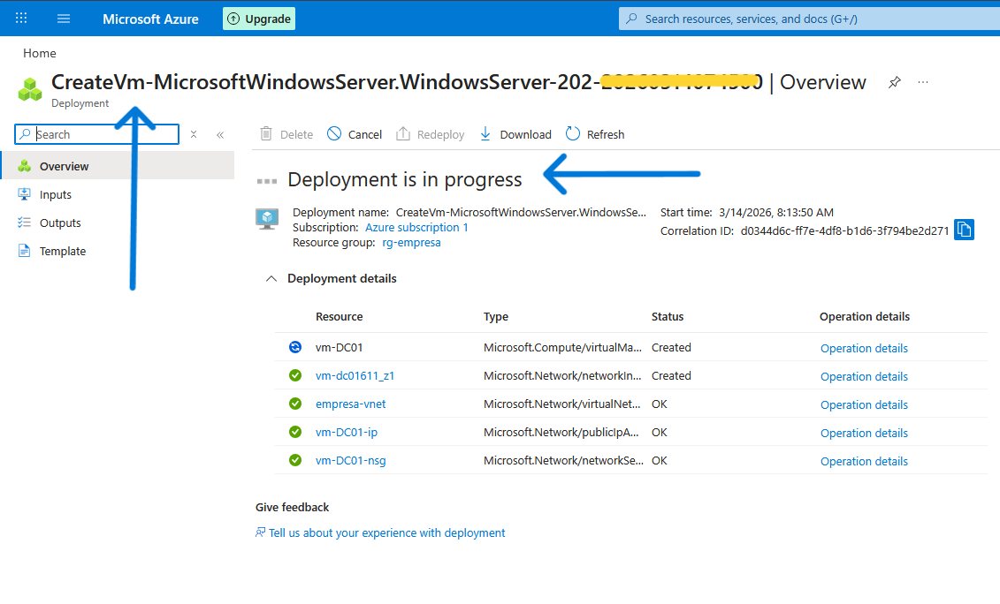

### 3. Conexão via RDP no servidor
Com a Virtual Machine apta para uso, seguimos para conexão via RDP no Windows Server

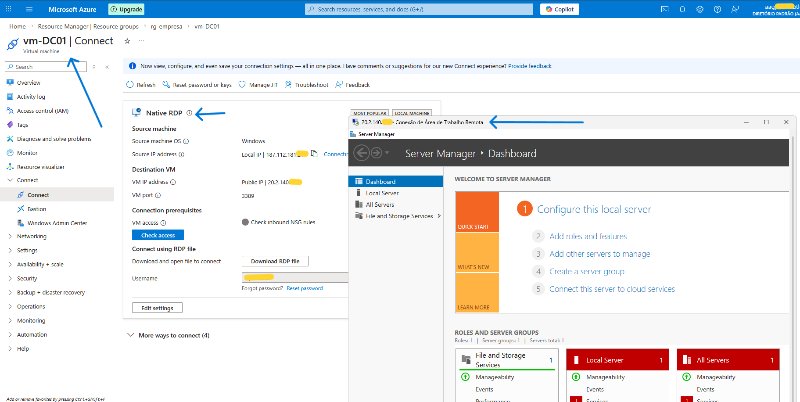

### 4. Instalação do Active Directory
Então partimos para instalação e configuração do Active Directory Domain Server

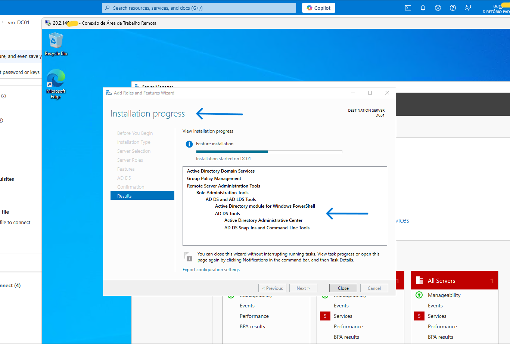

### 5. Configuração do DNS
E também aguardamos a configuração do serviço de DNS, que acontece automaticamente junto com o ADDS (sendo o DNS um dos itens mais importantes para o funcionamento adequado)

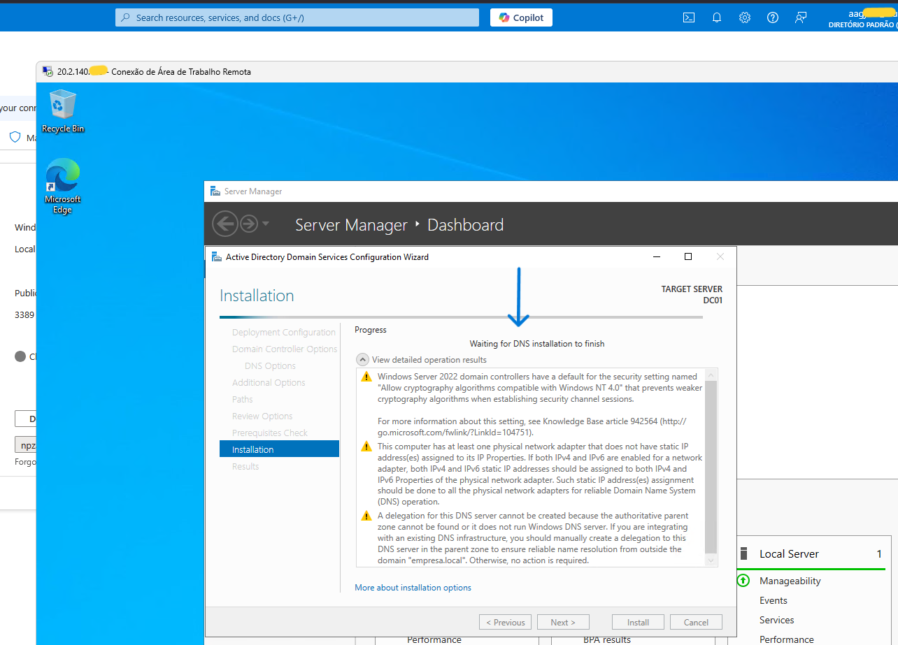

### 6. Criação de GPO
No Group Policy Management, optei por criar uma GPO a fim de testar nos usuários criados em OU de setores Financeiro, TI e RH. Nesse exemplo a GPO impede que o usuário cliente acesse o Painel de Controle do sistema.

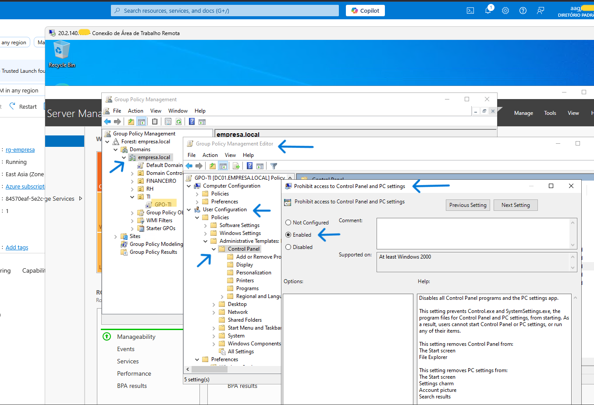

### 7. Criação de grupos
Aqui partimos para criação de grupos na forest empresa.local, onde já esão criados OUs para Financeiro, TI e RH e também usuários, João, Carlos e Maria, respectivamente. O propósito da criação de grupos é facilitar e centralizar a aplicação de GPOs, onde os usuários dos sistemas serão vinculados aos grupos.

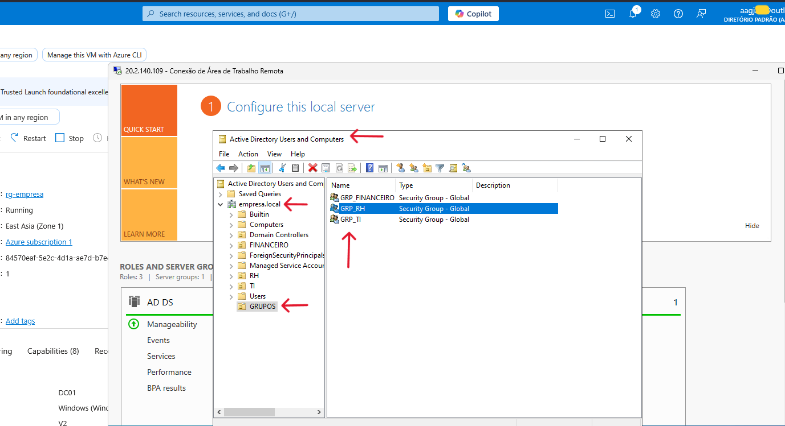

### 8. Inserção de usuário em grupo
Após a criação dos grupos para os setores da empresa, podemos então inserir os usuários em cada setor a que pertencem.

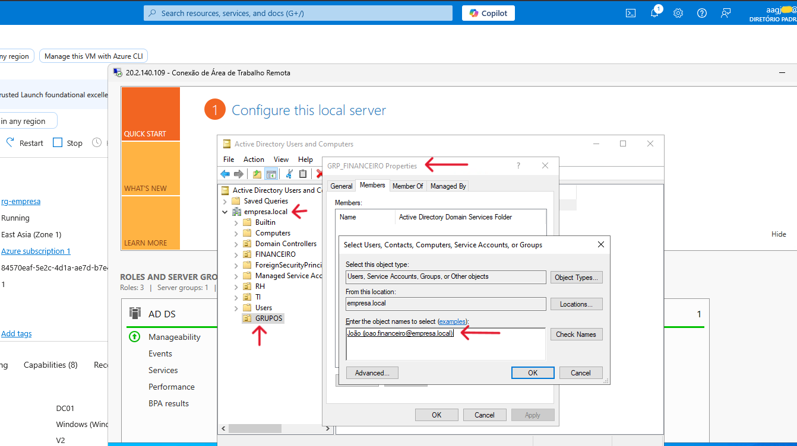

### 9. Configuração do File Server
Na configuração do File Server, partimos para criação de pastas que representam cada setor citado anteriormente, essas pastas serão compartilhadas na rede, centralizando os dados, facilitando manutenção, backup e controle geral. Mas  não iremos apenas compartilhar, configuraremos políticas de segurança para que cada funcionário tenha acesso  aos dados do seu respectivo setor.

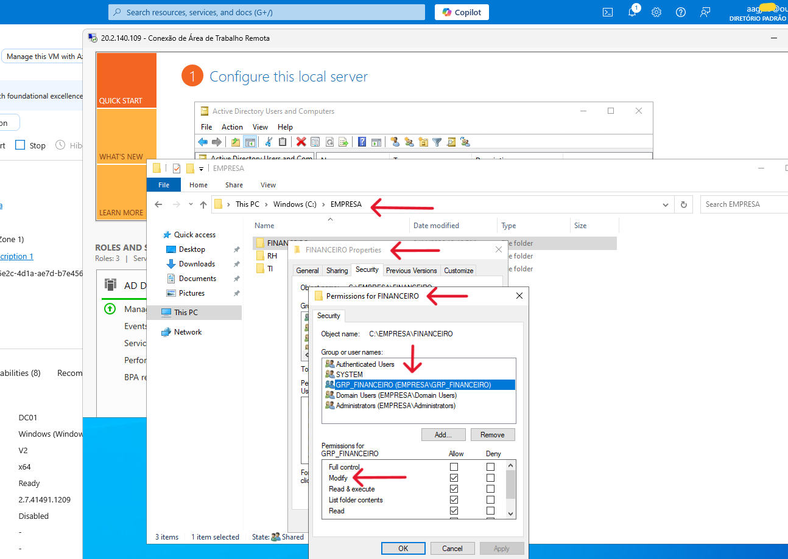

### 10. Criação da VM cliente
Após configurar a base do servidor, partimos para a criação da infraestrutura que representará uma máquina cliente (utilizada pelos funcionários criados)

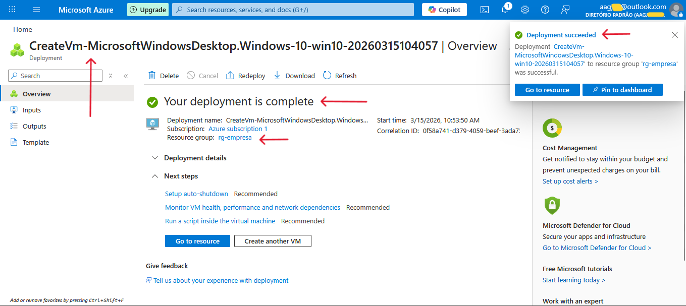

### 11. Conexão RDP no cliente
E então conectamos a ela utilizando também o Área de Trabalho Remota (RDP)

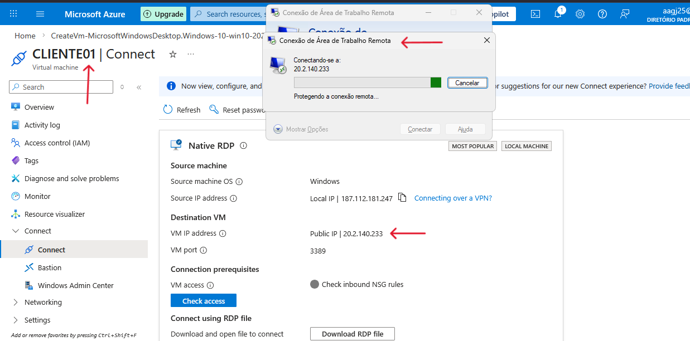

### 12. Ingresso no domínio
Após acessarmos a máquina Windows 10 criada, iremos primeiramente configurar o DNS da rede para o endereço do SERVIDOR criado (é de suma importância para que a rede saiba onde buscar os dados para consulta de autenticação, file server e outras funcionalidades), após isso fazer a inserção dela ao domínio criado no servidor anteriormente (EMPRESA.LOCAL), procedimento simples mas de extrema importância, pois é o que faz com que a máquina e usuários sejam de fato controlados pelo nosso servidor. É necessário a autenticação do administrador do servidor.

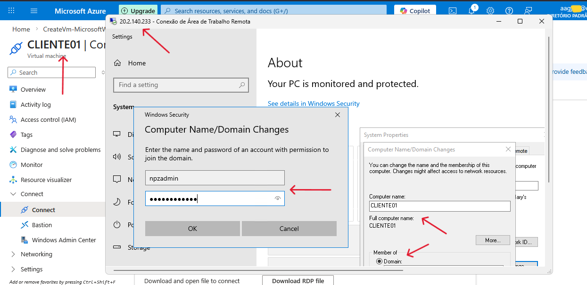

### 13. Sucesso no ingresso ao domínio

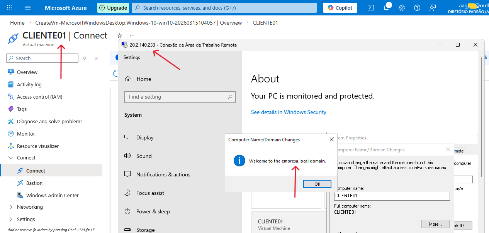

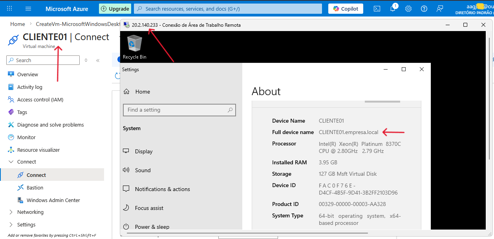

### 15. Unidade de rede mapeada
Após nosso Windows 10 cliente se juntar ao nosso domínio, os usuários criados no servidor poderão fazer login no sistema. E tendo configurado o MAPEAMENTO DE DRIVER corretamente nas configurações de grupos, cada usuário em seu primeiro login deverá poder ter acesso à pasta do seu setor, compartilhada no FILE SERVER automaticamente (isso evita o retrabalho ao ter que mapear unidades para cada usuário individualmente). No print em questão o login foi com o usuário JOÃO do FINANCEIRO.

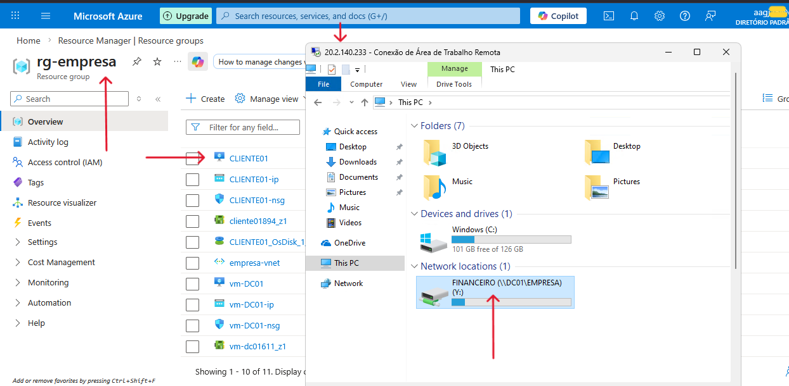

### 16. Restrição de acesso a pasta
E por questões de segurança (ou regras da organiação) configuramos políticas de segurança para que cada usuário tenha acesso  aos dados do seu setor.

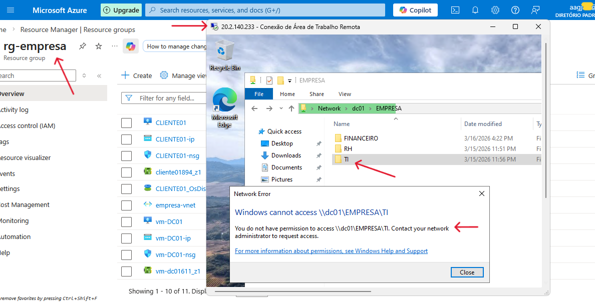

### 17. Access Based Enumeration configurado
Tambem foi configurado o serviço de Access Based Enumeration, que basicamente tem a função de listar arquivos e pastas baseados em permissões, caso não haja permissão o Windows automaticamente oculta os arquivos para aquele usuário.

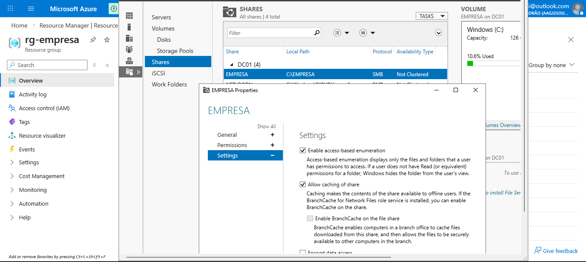

### 18. Erro de DNS (simulação de problema)
Para testes, intencionalmente foi desconfigurado o DNS do Windows 10 cliente, de 10.0.1.4 (DNS SERVIDOR) para 8.8.8.8 (DNS GOOGLE). Então ao tentar fazer login com a conta de um usuário, recebemos um erro que é impossível comunicar-se com o domínio.

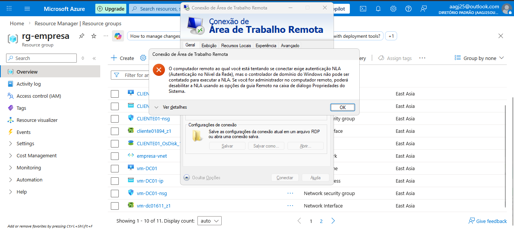

### 19. Correção de DNS
Após a simulação, como ADMINISTRADOR reconfiguramos o DNS do cliente para o DNS do nosso domínio e aplicamos o comando de terminal "ipconfig /flushdns" para limpar os dados de cache e considerar o novo DNS.

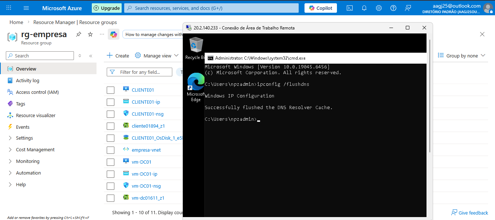

### 20. Validação final do cliente
Então, fizemos login com o usuário MARIA (que obteve êxito) mas  a título de confirmação de DNS, utilizamos o comando de terminal "nslookup dc01" (que é o nome do nosso servidor) e então temos seus dados retornados com sucesso.

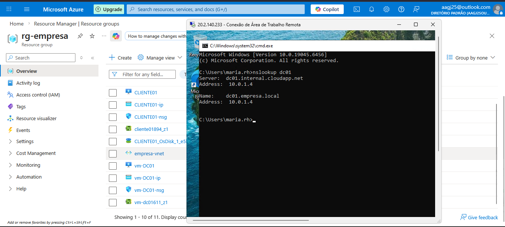

---

## 🧠 Aprendizados

* Implementação de ambiente de domínio
* Gerenciamento de identidades e acessos
* Aplicação de políticas corporativas
* Configuração e Diagnóstico de problemas de autenticação e rede

---

## 💼 Aplicação profissional

Este projeto simula um ambiente corporativo real, com controle de usuários, permissões e políticas, semelhante a cenários encontrados em suporte técnico nível.

